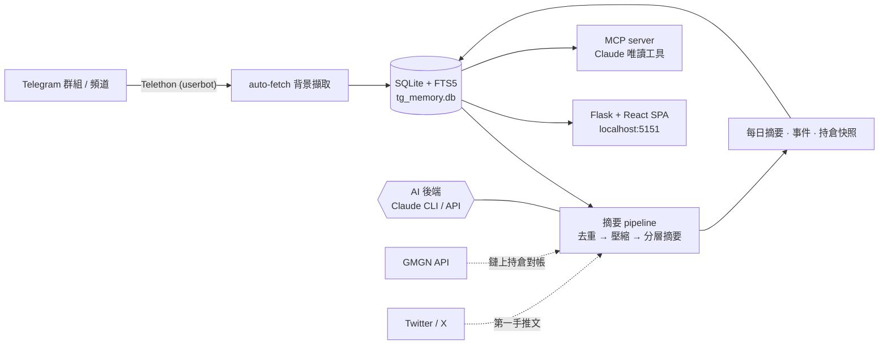

# TG Fetcher Pro

**把數十個高噪音的 Telegram 鏈上情報群,自動化成「擷取 → 去噪 → AI 摘要 → 可搜尋的個人記憶庫」。**


> 📌 **個人作品集專案(personal portfolio project)**,用來展示 **後端 / AI pipeline / 系統設計** 的工程實作。
> 為自用工具,**非產品、不提供安裝支援**;歡迎瀏覽 code 與架構。

---

## Demo

> 🎬 _(Demo 影片 / GIF 放這裡)_

<!--  -->

---

## 解決的問題

鏈上交易的早期情報散落在數十個高頻、高噪音的 Telegram 群與頻道,人工根本讀不完,也難以回溯「某顆幣當時誰先講、群裡怎麼反應」。

這個專案把整條流程自動化:**背景擷取並封存訊息 → 去重 / 壓縮 → 多階段 AI 摘要 → 存進可全文 + 語意搜尋的本地記憶庫**,並把整個情報庫以 MCP 工具開放給 Claude 直接查詢。重點不在「炒幣」,而在 **高噪音串流資料的擷取、壓縮與 AI 萃取管線設計**。

---

## 架構



---

## 技術亮點

- **雙 AI 後端可切換** — 同一套摘要邏輯,可走 Anthropic SDK(按 token 計費)或 shell 到 Claude Code CLI(吃訂閱額度);抽象掉成本 / 部署模型的差異。
- **多階段摘要 pipeline,對抗 context / CLI 限制** — 單一作者洗版時先用 **Haiku** 做 per-sender 結構化抽取 →「確定性」group rollup 壓縮 → **Sonnet** 最終摘要;每段都有 hard cap,避免超長 prompt 讓子行程卡死。
- **具復原力的排程** — 固定時刻 slot 模式 + 開機自動補跑錯過的 slot(電腦關機也不漏);長 AI 呼叫有 idle-timeout watchdog 與 heartbeat;單例檔鎖防止兩個 process 共用同一份 Telegram session 而損壞登入態。
- **持倉推導 + 鏈上對帳** — 從「只看變動」的 8h 視窗限制中,掃描封存訊息推導每個錢包「目前持倉」,再(選用)用 GMGN 即時餘額對帳,並以 leaky-bucket 限流保護 API。
- **本地記憶 + 語意搜尋** — SQLite **FTS5** 全文檢索 + **Voyage** embeddings 向量搜尋並行。
- **MCP server** — 把整個情報庫以唯讀工具(`messages_search` / `author_profile` / `coin_mentions` / `match_wallet_for_author` …)開放給 Claude,可在對話中直接查歷史。
- **務實的安全模型** — 綁定 localhost、`debug=False`、SameSite cookie + 自訂 header 的 CSRF 防護(設計前提:只在本機使用)。

---

## 技術棧

| 層 | 技術 |
|---|---|
| 後端 | Python · Flask(9 blueprints)· Telethon(async)· SQLite + FTS5 |
| AI | Anthropic Claude(Opus / Sonnet / Haiku)· Claude Code CLI · Voyage embeddings |
| 前端 | React 18 + Babel standalone(瀏覽器內 JSX,**無 build step**)|
| 整合 | GMGN · Twitter/X · MCP(Model Context Protocol)|
| 測試 | pytest（146 passing）|

---

## 本地執行

```bash
pip install -r requirements.txt
cp .env.example .env          # 填入 Telegram / Claude 等 API key
python server.py              # → http://127.0.0.1:5151
```

啟用 pre-commit 防密鑰外洩 hook(每次 clone 後設定一次):

```bash
git config core.hooksPath .githooks
```

設定項目見 [.env.example](.env.example);測試 `python -m pytest`。

---

## 安全與注意事項

> ⚠️ **只在本機 localhost 執行,絕對不要暴露到公網。**
> 後端用 SameSite cookie + 自訂 header 擋跨站請求,但**這不是針對「能直接連到 port 的人」的驗證**:任何能存取 `/` 的人都會拿到 API token。一旦綁到 `0.0.0.0`、或經 ngrok／反向代理／port-forward 對外,等於把你的 Telegram 帳號與整個 `tg_memory.db` 交出去。要遠端使用請自行加上真正的登入驗證。

- 使用者需自負 Telegram / GMGN / Twitter 等服務條款與當地法規(含他人訊息的隱私)之合規責任。
- 用個人帳號大量抓取／封存訊息可能違反 Telegram 服務條款,有帳號被限制的風險。
- `.env`(API keys)、`*.session`(= Telegram 帳號登入態)、`tg_memory.db`(摘要／筆記)皆已被 `.gitignore` 排除——請勿提交或外流,尤其 `*.session` 等同帳號鑰匙。

## License

[MIT](LICENSE)
